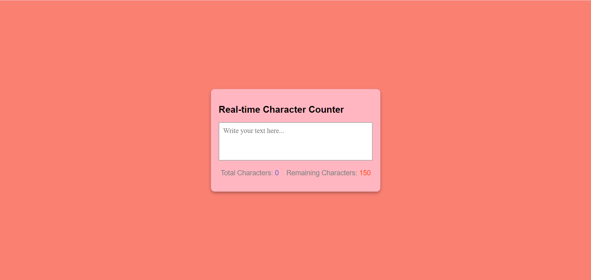

# Real-time Character Counter

This is basically a web app which allows you to write your text with real-time counting feature.

### Visit The Live Application   [↪️....CLICK....↩️](https://devtripathy.github.io/Real-time-Character-Counter-Web-App/)

## Language Used :-

- > HTML
- > CSS
- > JavaScript

## Preview Image :-

